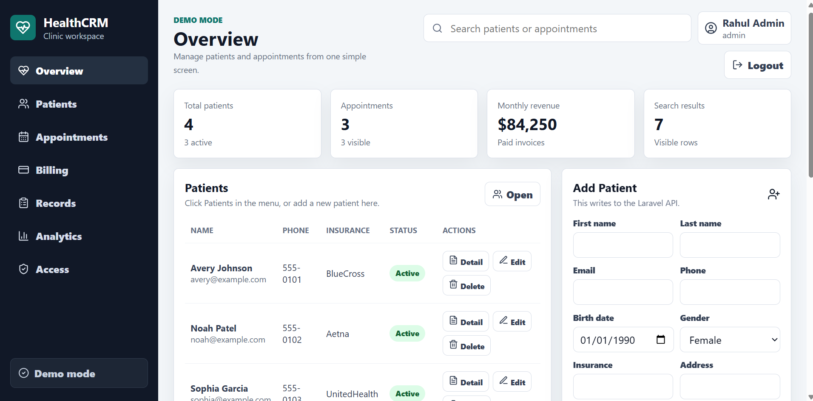
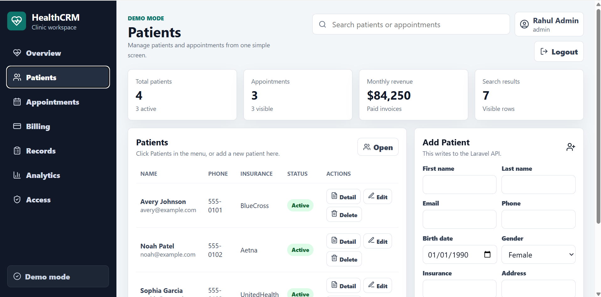
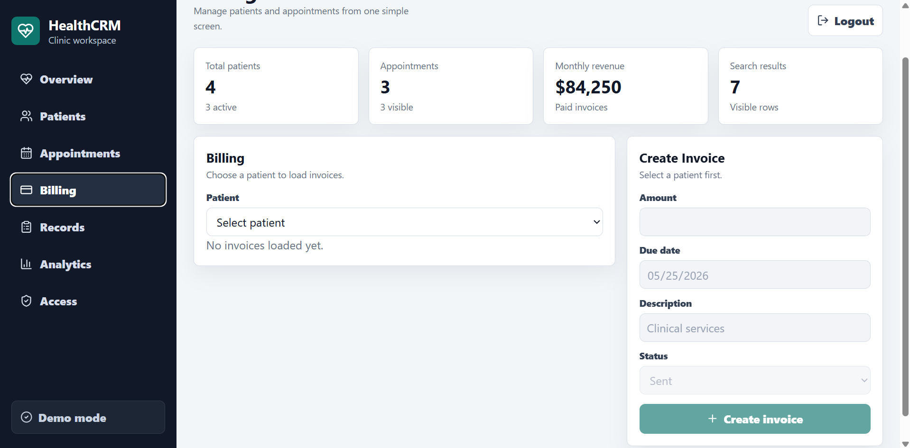
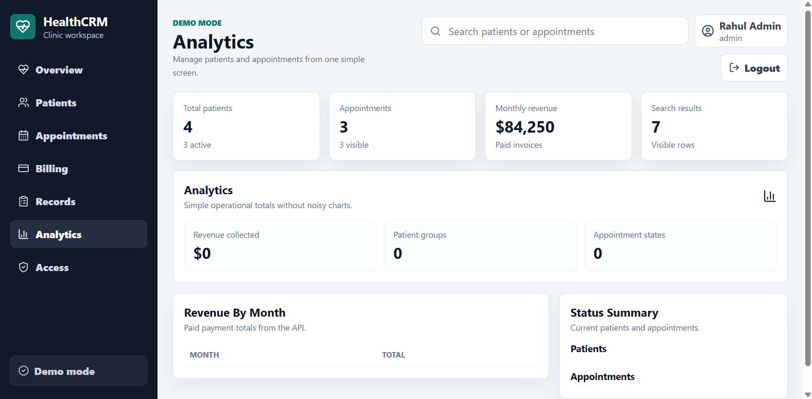
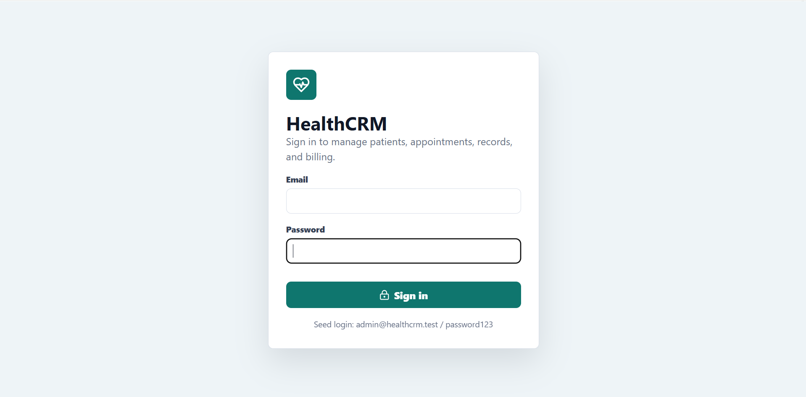

# Healthcare CRM Dashboard

A full-stack healthcare CRM for clinic operations. It includes JWT authentication, role-based API access, patient management, appointment scheduling, medical history notes, invoicing, demo payment recording, receipts, and analytics summaries.

## Project Highlights

- Built a full-stack healthcare CRM using Laravel 11, React 18, and MySQL
- Implemented JWT authentication with admin, doctor, and patient role access
- Developed patient, appointment, medical record, billing, invoice, and receipt workflows
- Integrated Stripe test Checkout plus local demo payment recording
- Added analytics summaries for patients, appointments, and revenue
- Dockerized the application and included backend/frontend automated tests

## Preview

### Overview Dashboard



The overview screen shows the clinic workspace, patient metrics, revenue summary, searchable records, patient actions, and the patient creation form.

## Screenshots

### Patient Management



### Billing & Payments



### Analytics



### Secure Login



## Features

### Application
- Patient create, edit, delete, search, and detail view
- Medical history notes per patient
- Appointment create, edit, complete, cancel, and delete
- Invoice create, edit, delete, local payment recording, Stripe test Checkout, and receipt view
- Analytics summaries for patients, appointments, and monthly revenue
- Login/logout with JWT
- Admin user management for admin, doctor, and patient accounts
- Role-based API restrictions

### Roles
- `admin`: full access, including billing and user management
- `doctor`: patients, appointments, records, and analytics
- `patient`: authenticated account role reserved for future patient portal access

## Tech Stack

### Backend
- Laravel 11
- PHP 8.2+
- MySQL 8
- JWT auth with `tymon/jwt-auth`
- PHPUnit feature tests

### Frontend
- React 18
- Vite
- Axios
- Lucide React icons
- Vitest API client tests

### DevOps
- Docker Compose
- GitHub Actions CI

## Quick Start

```bash
docker compose up -d --build
```

The Laravel container installs dependencies, prepares `.env`, runs migrations, seeds data, and starts the API.

Open:
- Frontend: http://localhost:3000
- API health: http://localhost:8000/api

Seed login:

```text
admin@healthcrm.test
password123
```

Other seeded account:

```text
doctor@healthcrm.test
password123
```

## Manual Setup

### Backend

```bash
cd backend
composer install
cp .env.example .env
php artisan key:generate
php artisan jwt:secret
php artisan migrate --seed
php artisan serve --host=0.0.0.0 --port=8000
```

### Frontend

```bash
cd frontend
npm install
cp .env.example .env
npm run dev
```

## Testing

Backend:

```bash
docker compose exec laravel php artisan test
```

Frontend:

```bash
cd frontend
npm test
npm run build
```

## API Endpoints

### Authentication

```text
POST /api/auth/login
POST /api/auth/logout
POST /api/auth/refresh
GET  /api/auth/me
POST /api/auth/register        admin only
```

### Users

```text
GET    /api/users              admin only
POST   /api/users              admin only
PUT    /api/users/{id}         admin only
DELETE /api/users/{id}         admin only
```

### Patients and Records

```text
GET    /api/patients
POST   /api/patients
GET    /api/patients/{id}
PUT    /api/patients/{id}
DELETE /api/patients/{id}
GET    /api/patients/{id}/history
POST   /api/patients/{id}/history
```

### Appointments

```text
GET    /api/appointments
POST   /api/appointments
GET    /api/appointments/{id}
PUT    /api/appointments/{id}
DELETE /api/appointments/{id}
GET    /api/appointments/search
```

### Billing

```text
GET    /api/patients/{id}/invoices
POST   /api/patients/{id}/invoices
PUT    /api/invoices/{id}
DELETE /api/invoices/{id}
POST   /api/payments
POST   /api/payments/stripe-checkout
POST   /api/payments/stripe-confirm
GET    /api/payments/{id}
POST   /api/payments/{id}/receipt
```

## Stripe Test Payments

Stripe is optional. The local demo payment flow still works without Stripe keys.

To use free Stripe test Checkout, add test keys to `backend/.env`:

```env
STRIPE_KEY=pk_test_your_key
STRIPE_SECRET=sk_test_your_key
FRONTEND_URL=http://localhost:3000
```

Restart Laravel after changing `.env`:

```bash
docker compose restart laravel
```

In the app:

1. Log in as admin.
2. Go to Billing.
3. Select a patient.
4. Create or choose an unpaid invoice.
5. Click `Stripe test`.
6. Use Stripe's test card:

```text
4242 4242 4242 4242
Any future expiry
Any CVC
Any ZIP
```

After Stripe redirects back to the app, the invoice is confirmed and marked paid.

### Analytics

```text
GET /api/analytics/dashboard
GET /api/analytics/patients
GET /api/analytics/revenue
GET /api/analytics/appointments
```

## Database Tables

- `users`
- `patients`
- `medical_histories`
- `appointments`
- `invoices`
- `payments`
- `roles`
- `permissions`
- `permission_role`

## Notes

- Stripe runs in test mode when test keys are configured. Do not commit Stripe secret keys.
- Payments can also be recorded through the local demo workflow.
- Do not commit generated logs from `backend/storage/logs`.
- The frontend intentionally uses simple tables and summary cards instead of chart-heavy analytics.

## License

MIT License - see [LICENSE](LICENSE).

## Author

Rahul Anilkumar
- LinkedIn: [linkedin.com/in/anilkumar-rahul](https://www.linkedin.com/in/anilkumar-rahul/)
- Email: rahulanilpunalur@gmail.com
